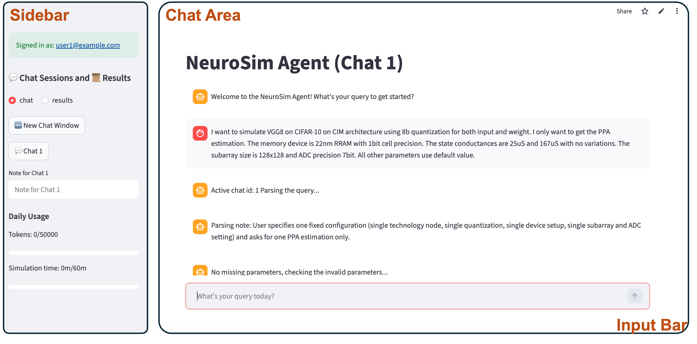

# ChatNeuroSim
ChatNeuroSim is an intelligent agent framework for automated Compute-in-Memory (CIM) accelerator deployment and optimization. The ChatNeuroSim framework was developed by [Prof. Shimeng Yu's group](https://shimeng.ece.gatech.edu/) (Georgia Institute of Technology). The model is made publicly available on a non-commercial basis. Copyright of the model is maintained by the developers, and the model is distributed under the terms of the [Creative Commons Attribution-Non Commercial 4.0 International Public License](http://creativecommons.org/licenses/by-nc/4.0/legalcode)

## Overview
ChatNeuroSim is an LLM-powered agent framework that automates:
+ CIM parameter parsing and validation
+ Script generation and NeuroSim execution
+ Automated design space exploration (DSE)
+ Optimization using pruning and search strategies
+ Web-based user interface support for trial runs

## User Interface
ChatNeuroSim is implemented in Python, and the agent workflow is developed using [LangGraph](https://github.com/langchain-ai/langgraph) with GPT-5.1 as the backend LLM API. The UI is designed using [Streamlit Python library](https://github.com/streamlit/streamlit). Below shows the UI window for trail runs. 



The UI includes the sidebar, chat area, and input bar. Users can input CIM simualtion requests in plain text as well as the adjustments. ChatNeuroSim automatically parses user's request, calls [NeuroSim V1.5](https://github.com/neurosim/NeuroSim) for CIM simulation, and shows the results in the "results" tab.

## Steps of Trail Run
**ChatNeuroSim is currently in its early development stage. We are offering invitation-based trial access to selected users who are interested in exploring the platform.**

Please follow the steps below to request access:
1. [**Request an Invitation**]

Send an email to the adminstrator [Ming-Yen Lee](mailto:mlee838@gatech.edu) and cc [Prof. Shimeng Yu](mailto:shimeng.yu@ece.gatech.edu) with the subject line:
```
Interested in ChatNeuroSim Trial Access (Your Name, Organization)
```
Please include these information in your email: **Full name, Affiliation (University / Company / Organization), Position / Title, and Purpose of using ChatNeuroSim**. After review and approval, you will receive **a Streamlit invitation link and a unique invitation code for login**.

2. [**Access the Web Interface**]
+ Use the provided Streamlit invitation link to access the web interface.
+ Log in using your email address and the invitation code.
+ Note: A Streamlit account is required to access the chat interface.

3. [**Start Using ChatNeuroSim**]
+ After successful login: Enter your simulation or optimization request in plain text.
+ The system will automatically: Parse your request, Validate parameters, Generate simulation scripts, Execute simulations, Return simulation results.
+ We have included some query examples to start with in the folder [/request_examples](https://github.com/mingyeen99/ChatNeuroSim/tree/main/example_query).

4. [**Usage Limits**]

For fair usage and system stability, we set resource limits per user.
Each user has:
+ A daily limit on LLM API token usage
+ A daily limit on NeuroSim simulation runtime
These limits are refreshed every 24 hours at 12:00 PM EST.
You can monitor your remaining usage quota directly within the web interface.

## Video Demo
[Watch Demo Video](https://www.dropbox.com/scl/fi/ahipgf89fuc9y9ivjhtty/Demo_ChatNeuroSim.mp4?rlkey=ed5dfwzsp65a4wfeh1dgkvdoc&st=bq73xa9z&dl=0)

## Acknowledgement
This research is supported by NSF CAREER award, NSF/SRC E2CDA program, the ASCENT center (SRC/DARPA JUMP 1.0) and the PRISM and CHIMES centers (SRC/DARPA JUMP 2.0).

## Developers
:two_men_holding_hands: [Ming-Yen Lee](mailto:mlee838@gatech.edu)

## Citations
If you use the tool or adapt the tool in your work or publication, you are required to cite the reference mentioned below.
[ChatNeuroSim: Arxiv]

## Contact
If you have logistic questions or comments on the model, please contact :man: [Prof. Shimeng Yu](mailto:shimeng.yu@ece.gatech.edu), and if you have technical questions or comments, please contact :man: [Ming-Yen Lee](mailto:mlee838@gatech.edu)

## Recent Update
:star2: [2026.03.01] Initial version release.

## References Related to This Tool
1. M.-Y. Lee, S. Yu. ※ChatNeuroSim: An LLM Agent Framework for Automated Compute-in-Memory Accelerator Deployment and Optimization, *§ arXiv: *, 2026.
3. J. Read, M.-Y. Lee, W.-H. Huang, Y.-C. Luo, A. Lu, S. Yu, ※NeuroSim V1.5: improved software backbone for benchmarking compute-in-memory accelerators with device and Circuit-Level Non-Idealities, *§ IEEE Transactions on Computer-Aided Design of Integrated Circuits and Systems*, 2026.
4. M.-Y. Lee, S. Yu, ※NeuroSim Agent: Automated Compute-In-Memory Accelerator Deployment with Transferable Reinforcement Learning and Dynamic Design Space Pruning, *§ 2025 ACM/IEEE 7th Symposium on Machine Learning for CAD (MLCAD)*, 2025.
5. J. Lee, A. Lu, W. Li, S. Yu, ※NeuroSim V1.4: Extending Technology Support for Digital Compute-in-Memory Toward 1nm Node, *§ IEEE Transactions on Circuits and Systems I: Regular Papers*, 2024.


